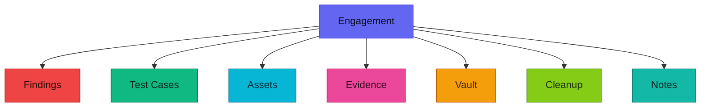
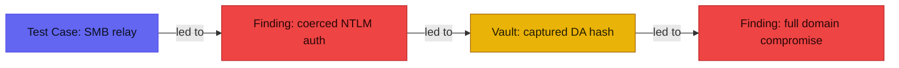
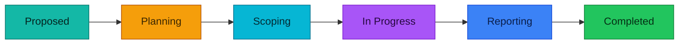
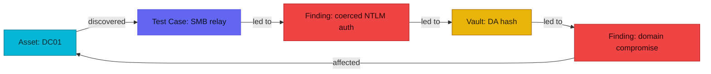

# RedWire user guide

Everything an operator needs to run an engagement in RedWire — from scoping a
test through delivering the report. If you administer the platform (installs,
backups, integrations), see the **Admin guide** instead.

## The big picture

RedWire organizes work around **engagements**. An engagement is a single
assessment (a client, a scope, a timeframe, a team) and it owns everything you
produce during it:

Almost every screen is scoped to the engagement you're currently in. Use the
engagement switcher in the top-left of the header to change context, or open an
engagement from the **Engagements** list.

>  New here? Every
> page has a matching **?** button in the app header — click it for a quick
> explainer of what you're looking at.

## Working an engagement

Open an engagement to land on its **Overview**, then move through the tabs — the
icons and colours are the same ones you'll see in the app:

| Tab | What lives there |
|---|---|
|  **Overview** | Status, dates, the team, quick counts, and a recent-activity feed. |
|  **Findings** | Your vulnerabilities — CVSS-scored, with evidence and links. |
|  **Test Cases** | What you tried, pass/fail, as a tree; linked to the findings they produced. |
|  **Assets** | Hosts, services, URLs, and other in-scope targets. |
|  **Attachments** | Evidence files (screenshots, PCAPs, output). |
|  **Vault** | Recovered credentials, keys, and tokens — encrypted at rest. |
|  **Cleanup** | Artifacts you dropped (accounts, keys, shells), tracked to *Cleaned*. |
|  **Notes** | Free-form working notes with Markdown + Mermaid + links. |
|  **ATT&CK** | MITRE ATT&CK coverage mapped from findings and test cases. |
|  **Activity** | Audit stream of everything the team posted, with content diffs. |
|  **Reporting** | Generate the deliverable. |

Each tab loads its data on demand, and the count badges show live totals.

##  Findings

The core of the work. To raise one, open **Findings → New Finding**:

1. **Title + description** — what it is and how to reproduce it. The editor
   supports Markdown, code blocks, inline images (paste a screenshot straight
   in), and Mermaid diagrams.
2. **Severity / CVSS** — set the CVSS vector; severity is derived from the score.
3. **Remediation** — how the client fixes it.
4. **Link related work** — attach evidence, and link the assets, test cases,
   vault items, and cleanup artifacts involved. These show as chips in the
   Findings table's **Links** column.
5. **Status** — move it through your workflow (Open → … → Verified / Closed).

Findings keep full **version history** — every edit is snapshotted, and you can
view or **restore** a previous version.

**Severity at a glance** — the same colours the app uses everywhere:

| Severity | Rough meaning |
|---|---|
| Critical | Immediate, high-impact compromise. |
| High | Serious issue, exploit likely. |
| Medium | Real risk, needs the right conditions. |
| Low | Minor / limited impact. |
| Info | Informational, no direct risk. |

##  Evidence

Attach files to an engagement, a finding, or a test case. Drag-and-drop, use the
shared dropzone, or **paste an image straight from your clipboard**. Evidence can
be flagged **include-in-report**, captioned, and (for images) you can inspect or
**strip EXIF** metadata before it ships.

##  Links & chains

Two ways to connect things — they answer different questions.

**Links** are broad associations. From a finding, test case, asset, note, or
vault item you can link the things it relates to — the assets a finding affects,
the test cases that produced it, the evidence, notes, intel, and infrastructure
involved. They show as the icon chips in the **Links** column of each table and
keep the engagement joined-up. Links are symmetric: link a test case to a
finding and the finding shows the test case too.

**Chains** answer *"what led to what?"* — a directed **cause → effect** graph over
the three things that carry an attack narrative: **findings**, **test cases**,
and **vault items**. Each chain link is one arrow, "source **led to** target":

Open the **chain editor** on a finding, test case, or vault item and you'll see
two lists: **Caused by** (what led to this) and what **this led to**. Add a step
in either direction, or **promote** something you've already *linked* straight
into the chain. Each directed pair links once; the reverse is its own link, so a
loop is always explicit.

These chains — together with your links — are what the engagement's **attack
graph** is built from (see *Reports*).

Notes, by the way, are fully linkable too: connect a note to any finding, test
case, asset, or vault item so your working thoughts stay attached to the work.

## Intelligence & Infrastructure

-  **Intel** items
  (OSINT, threat intel) link to the findings and test cases they inform.
  Admin-configurable RSS feeds can pull in external sources.
-  **Infrastructure**
  items (redirectors, C2, phishing infra) can be tracked and linked, so the
  report shows the kit behind the test.

##  Imports

**Imports** ingests scanner output into assets/findings — **Nmap, Nessus, Burp,
Nuclei**. Nmap imports also capture the exact command line and scan metadata as
revisitable **scan history**. Start from the engagement overview so it's
pre-scoped, upload the file, review the **preview**, then commit.

##  Planning, scheduling & calendar

- **Planning** — an org-wide view of every engagement as a **Gantt** timeline or
  a **Calendar** month grid, with a date-range filter and a *jump to engagement*
  picker. Colour-coded by status:

- **Scheduling** — find availability across the team for an engagement or date
  range, factoring in out-of-office.
- **Calendar** — your personal Day / Week / Month / Gantt view of assignments and
  out-of-office. Set your own OoO here.

##  Reports

Open **Reporting** on an engagement to generate the deliverable:

| Format | Best for |
|---|---|
|  **PDF** | The polished client report. |
|  **HTML** | A self-contained interactive report you can email or open offline. |
|  **JSON** | A structured export (with entity relationships) for tooling. |

Output honours the evidence you flagged include-in-report, classification /
portion marking, and the report **theme** + **layout** you pick — all of which
come from **Templates** (below).

The engagement also has a visual 
**attack graph** — a node-and-edge map of its assets, test cases, findings,
cleanup, and infrastructure, wired together by your links and the cause → effect
chains above. It's the picture that tells the "how we got in" story alongside the
written findings:

##  Templates

Templates let you standardise work so you're not rebuilding it every engagement.
The **Templates** hub has a tab per kind:

-  **Finding templates** —
  reusable finding content (title, category, description, impact, mitigations).
  When you raise a finding you can start from one to pre-fill it, then tailor.
-  **Test-case
  templates** — reusable test cases to drop into an engagement.
-  **Runbooks** — a
  curated set of test cases with a lifecycle (draft → published). **Apply** a
  runbook to an engagement to materialise its whole set of test cases at once, so
  every engagement of a given type starts with consistent coverage. Only
  published content applies.
-  **Report layouts**
  — the section structure and order of a report.
-  **Report themes** —
  the visual styling (cover, fonts, colours) of a report.
-  **Marking profiles**
  — classification / portion-marking sets applied to an engagement and carried
  into its reports.

**The flow:** build a template once → reuse it. Findings and test cases pull from
a template at create time; runbooks are *applied* to an engagement to materialise
test cases; layouts, themes, and marking profiles are chosen when you generate the
report.

##  Notifications & email

The bell in the header shows in-app notifications (mentions, assignments,
automation actions). The full **Notifications** page lets you search, filter,
sort, and mark read/unread. In your **Profile** you can opt in to **email**
notifications and mute categories you don't care about.

##  AI assistant

The in-app AI chat answers questions about your engagements and runs read-only
lookups for you — it operates under **your** permissions, so it can only see what
you can see.

##  Search & the command palette

- **Global search** (top of the app) spans engagements, findings, test cases,
  assets, notes, and comments.
- **Command palette** — press **Ctrl / Cmd-K** for quick navigation and create
  actions, plus vim-style key sequences (e.g. `g e` → engagements, `n f` → new
  finding).

##  Your profile

Set your display name, photo, and password; enrol **TOTP** two-factor; manage
notification preferences; and record your **skills** (used by the growth-fit
matching on the planning page).

## Tips

- **@mention** teammates in comments and notes — they get a notification that
  deep-links back to the exact thread.
- Timestamps are shown in your **local** time throughout the app.
- The **What's New** entry in the user menu (bottom-left) shows recent release
  notes; the changelog also lives at **/changelog**.
